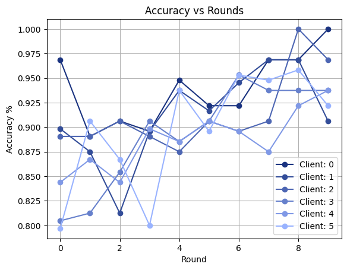

# Robust-Federated Learning with cGANs
References [Usama et. al](https://arxiv.org/pdf/2503.20884)   
[Kaggle Notebook](https://www.kaggle.com/code/kartikeysharmaah/cgan-federated-learning)

**Observation**   
Clients' accuracy over the MNIST dataset   
(averaged over 15 trials)   

