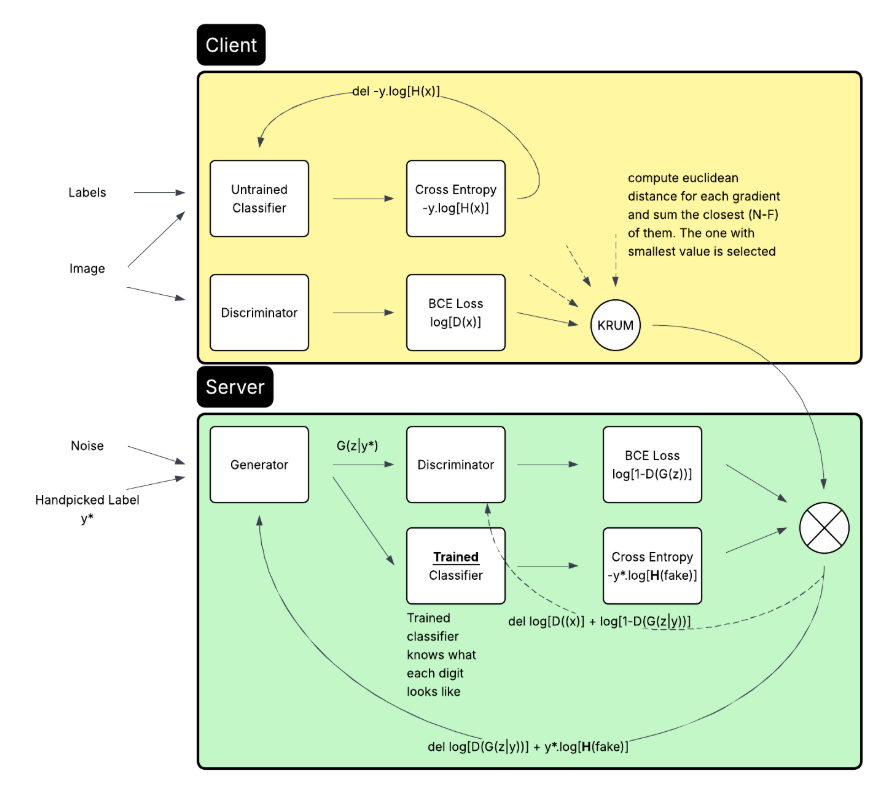
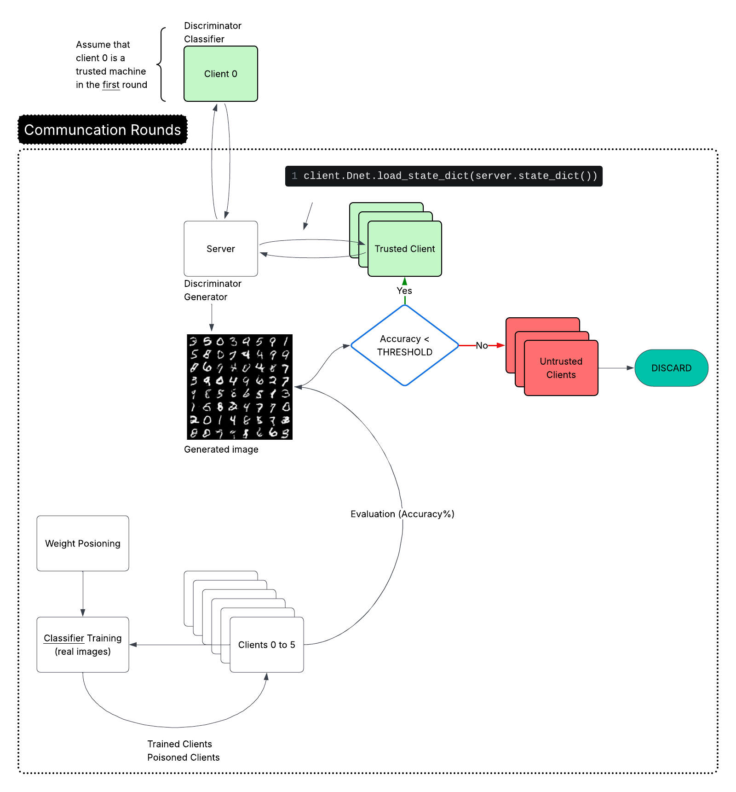

## Byzantine-Robust Federated Learning with WCGAN

Federated Learning allows collaborative model training without sharing the underlying data. However, there has been recent research on the robustness of such frameworks against malicious clients who could poison the local dataset or weights, degrading the global model and the entire process. Current robust aggregation methods include trimmed mean, median, or selecting the weights *closest to the majority* (KRUM). But these methods are either susceptible to client heterogeneity or are based on simplified heuristics. [Usama et. al](https://arxiv.org/pdf/2503.20884) suggested using a modified GAN network at the server, where we generate a synthetic dataset for each aggregation round. This dataset should ideally be representative of the client data, and if a client has poor performance on this dataset, it could have malicious weight. However, we notice that the generated synthetic data was uninterpretable and did not come close to resembling client data. Our work replaces the GAN with a distributed Wasserstein GAN model. Here is how it works

- We deploy multiple discriminators, one on each client, and a single generator on the server side.
- The discriminator is trained on the client data and shares the gradients for the loss functions with the server.
- These gradients are robustly aggregated using KRUM.
- The aggregated gradients are used to update the central generator and the discriminators.
- Once trained, this generator can be used to generate synthetic data.

We noticed that the data generated was interpretable and resembled the client dataset.

*Figure 1. One aggregation step*

*Figure 2. Overall federated learning along with malicious client filtration*

---
